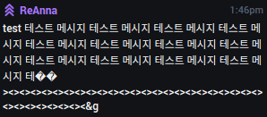

# plug-message-split

Reliable message splitting for plug.dj chat messages.

## Why?

plug.dj's chat server truncates chat messages at 250 bytes (not characters). It also
first html-escapes some characters before truncating. This leads to funny bugs when
using certain characters:



This library splits or truncates messages taking all known plug.dj oddities into
account.

## Installation

```sh
npm install --save plug-message-split
```

## API

```js
var msg = require('plug-message-split')
msg.split(string)
msg.splitRaw(string)
msg.truncate(string)
msg.escape(string)
msg.unescape(string)
```

### split(string): Array&lt;string>

Split a message for plug.dj on full words only.

### splitRaw(string): Array&lt;string>

Split a message on full characters. This might break words in two, but unicode
characters will be kept intact.

### truncate(string): string

Truncate a message to only full characters. Any content beyond the 250 bytes
limit is discarded. It might break words, but not characters.

### escape(string): string

HTML-escape a string like plug.dj escapes chat messages.

### unescape(string): string

Reverse plug.dj's chat message escaping. Useful for normalizing incoming chat
messages.

## License

[MIT]

[MIT]: ./LICENSE